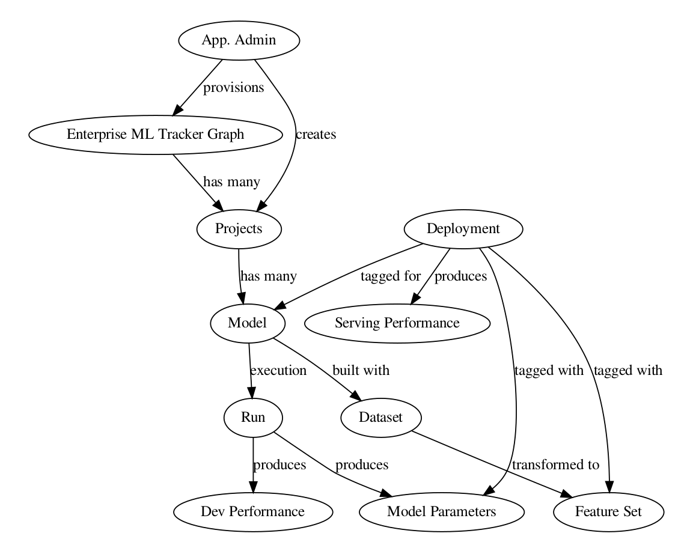
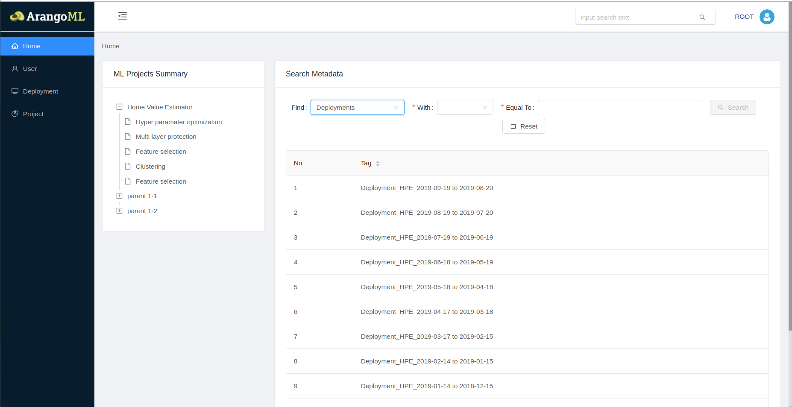
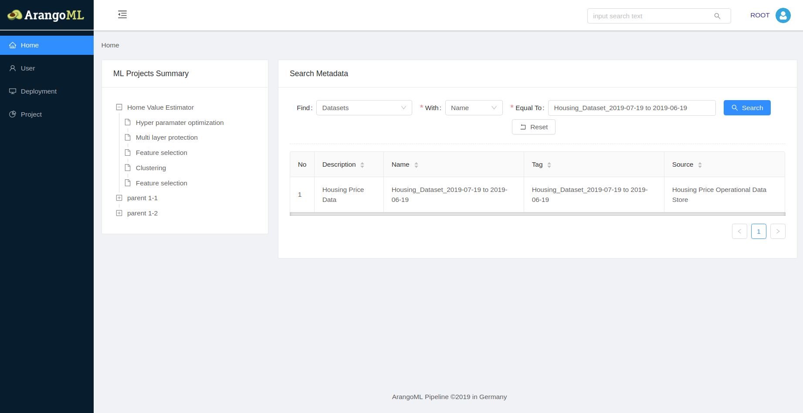
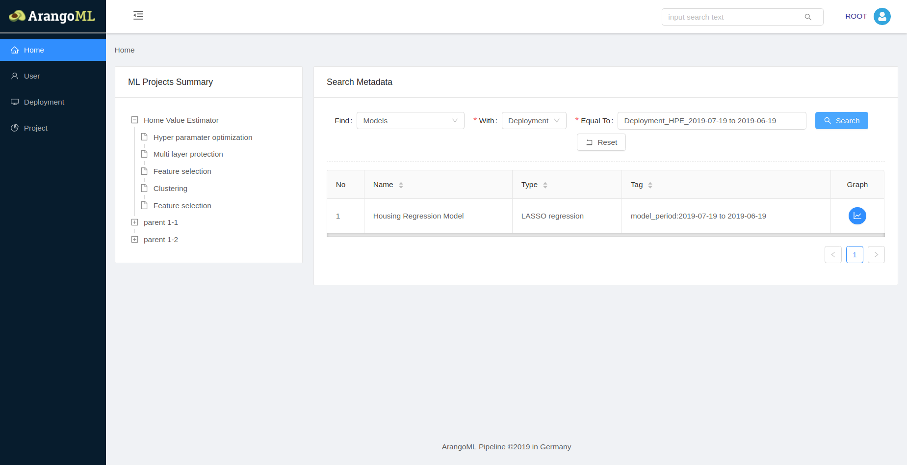

# ArangoML Pipeline

ArangoML Pipeline is a common and extensible Metadata Layer for Machine Learning Pipelines which allows Data Scientists and [DataOps](https://en.wikipedia.org/wiki/DataOps) to manage all information related to their ML pipeline in one place.

## Introduction
When productizing Machine Learning Pipelines (e.g., [TensorFlow Extended](https://www.tensorflow.org/tfx/guide) or [Kubeflow](https://www.kubeflow.org/))
the capture (and access to) of metadata across the pipeline is a vital. Typically, each of the  components of such ML pipeline produces/requires Metadata, for example:
* Data storage: size, location, creation date, checksum, ...
* Feature Store (processed dataset): transformation, version, base datasets ...
* Model Training: training/validation performance, training duration, ...
* Model Serving: model linage, serving performance, ...

Instead of each component storing its own metadata, a common Metadata Layer allows for queries across the entire pipeline and more efficient management.
[**ArangoDB**](https://www.arangodb.com) being a multi model database supporting both efficient document and graph data models within a single database engine is a great fit for such kind of common metadata layer for the following reasons:
* The metadata produced by each component is typically unstructured (e.g., TensorFlow's training metadata is different from PyTorch's metadata) and hence a great fit for a document databases
* The relationship between the different entities (i.e., metadata) can be neatly expressed as graphs (e.g., this model has been trained by *run_34* on *dataset_y*)
* Querying the metadata can be easily expressed as a graph traversal (e.g., all models which have been derived from *dataset_y*)

## Use Cases
ArangoML Pipeline benefits many different scenarios including:
* Capture of Lineage Information (e.g., Which dataset influences which Model?)
* Capture of Audit Information (e.g, A given model was training two month ago with the following training/validation performance)
* Reproducible Model Training
* Model Serving Policy (e.g., Which model should be deployed in production based on training statistics)
* Extension of existing ML pipelines through simple python/HTTP API

## Overview
Arangopipe is a ArangoDB API component for tracing meta-data about machine learning projects. Tracking details of machine learning experiments, like hyper-parameters, or details of optimization techniques, etc., are of explicit concern to data scientists. This need is well served by most machine learning frameworks that are currently around. For example,  [**Tensorboard**](https://www.tensorflow.org/guide/summaries_and_tensorboard), can be useful for this purpose for data scientists using Tensorflow. Analyzing modeling results in the aggregate, rather than focusing on a small set of experiments is equally important to data scientists. For example, data scientists may be interested in:

1.  Finding out the range of modeling techniques that have been used for a particular modeling task.
2.  Finding out the range of feature engineering techniques that have been used for a particular modeling task.
3.  What feature selection or feature extraction methods are useful for a particular modeling task?
4.  Did adding a particular attribute to a dataset result in consistent performance gains?
5.  How many datasets have been used for a particular modeling task last year?

Machine learning tools and libraries focus of solving machine learning problems and are not explicitly concerned with tracking information to answer questions such as the above. This is the need  **Arangopipe**  fulfills.  **Arangopipe**  tracks the following data from machine learning experiments:

1.  Data for Model Building: Data that goes into the model building activity is tracked. This includes meta-data about the model, the hyper-parameters associated with the model, the featureset used for model building and the dataset used to generate the featureset.
2.  Data from Model Building: Data from model building activity is tracked. This includes data about the model parameters (post optimization) and optimization parameters (learning rates, batch-sizes, optimization technique etc.)
3.  Data from Model Performance: Data about the model performance is tracked. This includes performance observed in development and deployed model performance.

##  Usage
Arangopipe has two components:
1. **Arangopipe**
2. **ArangopipeAdmin**

**ArangopipeAdmin** is an administrative component. It is meant to provision projects and users into **Arangopipe**. When projects and users have been provisioned in **Arangopipe**, they can start using **Arangopipe** to track data from their machine learning experiments. To begin with, data scientists can *register* entities like datasets, featuresets and model meta-data with **Arangopipe**. Registration yields an identifier for the entity that they can use to reference the entity in their subsequent interaction with **Arangopipe**. Information provided during registration includes a component name that they can use to *lookup* the identifier for the entity using the lookup API.
When data scientists have refined their models to a point where they are ready to track it and log its performance during model development, they can do so with a simple API call. If the model is deployment ready, they can indicate this by adding a deployment tag as part of the data provided to the model tracking API.  When models have been deployed, **Arangopipe** administrators provision a *deployment* entity in **Arangopipe** to start tracking the serving performance of the deployed model. As serving performance becomes available, it can be recorded against this deployed entity.

## Getting Started

To facilitate an easy start, docker containers for *torch* and *tensorflow* are provided. These containers have all components of the **ArangoML Pipeline** (Arangopipe, ArangoDB and the Arangopipe user interface). To get started:

1. Install [_docker_](https://docs.docker.com/install/)

2. Start the container of your choice (*tensorflow* or *torch*):

    ` docker run -p 6529:8529 -p 8888:8888 -p 3000:3000 -it arangopipe/ap_tensor_flow`  (_tensorflow_)
    
    or, for _torch_,
    
    ` docker run -p 6529:8529 -p 8888:8888 -p 3000:3000 -it arangopipe/ap_torch`

3. Running an example in the *torch* container: Run the *torch* docker container. You will have to use the `docker ps` command and get to the shell in the container using the `docker exec` command. Change directory to the `examples/pytorch` directory. The *torch* container provides an example of a linear regression model that uses **Arangopipe** to log experiment metadata. The experiment meta data includes information about the dataset, featureset and optimization settings used to run the *pytorch* model. Once you are in the shell of the *torch* container, run the driver program that develops the torch model and logs the experiment meta-data to *arangopipe*. To run the driver program, launch an `ipython` shell. In the shell, execute the following:
    1. `from ch_torch_linear_regression_driver import run_driver`
    2. `run_driver()`

    The details are shown in the figure below.

 
    

4. Execute this step after the model development step above has completed. Point your browser http:localhost:3000. Login to the Arangopipe user interface with username  root and password  `open sesame`. Select `Models` in the `Search Metadata` content pane. You should see the model you developed in the previous step. The details are shown in the figure below.

    
    
5. Running an example in the *tensorflow* container: Run the tensorflow container. Point your browser to http://localhost:8888. You will be prompted for a password. Use `root` for the password. In the file browser that is presented in the Jupyter notebook, open the `examples` directory and then open the  `TFX` directory. Open the notebook `tfx_metadata_integration.ipynb`. Read the description of the notebook. This notebook provides an example of how **Arangopipe** can be used with *tensorflow*. The utility of the multi-model feature of **ArangoDB** is leveraged in this example. [Tensorflow Data Validation](https://www.tensorflow.org/tfx/data_validation/get_started) is used to generate the summary statistics for a dataset. This *tensorflow* artifact can be stored in **Arangopipe** and reused as needed. This capability is illustrated in this notebook.

6.  Execute this step after you have executed all the cells in the notebook discussed in the previous step. Point your browser to http://localhost:3000. Login to the Arangopipe user interface with username  root and password  `open sesame`. Select `Featursets` in the `Search Metadata` content pane. You should see the featureset logged with **Arangopipe** resulting from executing the notebook discussed in the previous step.

    
    
5. You can generate test data to explore the **Arangopipe** user interface. Execute a `docker ps` command to get the ID of the running container. You can then get to a shell in the container using the `docker exec` command. Once you are in the container shell, you can generate test data to try **Arangopipe** using the `test_data_generator` utility provided with **Arangopipe**. The details are shown in the figure below.

    <!---  --->
    

    Read the section, "Arangopipe User Interface Application", for details about the features of the **Arangopipe** user interface.

6. The *tensorflow* and *torch* containers contain examples of using **Arangopipe** with common tools in a machine learning stack. Examples that show **Arangopipe** can be used with *hyperopt*, *sklearn* and *mlfow* are provided. To get the details of where these examples are located in the container, use the links below. These links provide a brief description of each example.

    Tensorflow:

    

    Torch:

    
 

7. To access the notebook examples provided with the docker container, point your browser to:  `http://localhost:8888` to get to a **Jupyter** notebook. The default notebook password is _root_

8. Point your browser to: `http://localhost:6529` to get to the **ArangoDB** web user interface. The `root` password is `open sesame`.

## Arangopipe Graph Model

### Data Dictionary

Arangopipe represents metadata as a graph. The nodes of the graph above are the principal elements about which metadata is gathered. These elements are high level abstractions that are encountered in any machine learning pipeline. A brief description of each of these elements is provided. Elements of the data model are either nodes or edges.

1. Dataset: This node captures metadata about datasets. Examples of attributes could be the storage location (URL), source system, creation date, summary statistics etc. .
2. Featureset: This node captures metadata about the features in the dataset. A featureset is obtained by applying a transformation to a dataset.
3. (Edge) Featureset - Dataset: Captures the dataset the associated featureset was generated from. Details of the transformation, for example the jupyter notebook that performs the transformation could be captured as part of the edge data.
4. Run: Captures metadata about the execution of a pipeline, for example the start time and the end time, status of execution (errors encountered) etc. .
5. Project: Captures metadata about the project associated with a pipeline. This is created with **ArangopipeAdmin**
6. Model: Captures metadata about the model. JSON serialized representations of model metadata can be stored if desiered. For example, if the model is used for hyper-parameter optimization. The hyper-parameter space can be stored in JSON serialized format.
7. DevPerf: Captures metadata about the performance metrics gathered during execution of the pipeline. The metric captured depends on the purpose of the model. It could be the root mean square error (RMSE) for a regression model or the best performing model and associated hyper-parameters for a hyper-parameter optimization model.
8. Deployment: Captures metadata about a particular production deployment. This could include details like the scheduled date, current status (scheduled, active, archived )etc.
9. ServingPerf: Captures the serving performance for a particular period. This is associated with a deployment and could include a collection of metrics, for example model performance metrics, average response time etc. .
10. (Edge) Deployment - Model: Captures the model associated with a deployment
11. (Edge) Deployment - SevPerf: Captures the serving performance associated with a deployment.
12. (Edge) Run - Model: Captures the model associated with a pipeline execution
13. (Edge) Run - DevPerf: Captures the model performance observed in development
14. (Edge) Run - Dataset: Captures the dataset associated with a pipeline execution
15. (Edge) Run - Featureset: Captures the featureset associated with a pipeline execution.
16. Model Params: This captures the hyper-parameters and the parameters associated with model development.
17. (Edge) Run - Model Params: This captures the model parameters obtained with a pipeline execution.
18. (Edge) Deployment - Featureset: This captures the featureset associated with a deployment.
19. (Edge) Deployment - ModelParams: This captures the model parameters used with a deployment.
20. (Edge) Project - Models: This captures the models associated with a project.

The data associated with the nodes and edges of the graph are stored as documents. The documents do not have a fixed structure and represent data using key-value pairs. This offers flexibility and permits users to decide the metadata elements that they would like to store. This also permits users to store metadata from any machine learning tech stack in Arangopipe.

## Installing Arangopipe API
If you would like to use **Arangopipe** with your pipelines, you would need to do the following:

1. `pip install sklearn`

2. `pip install python-arango == 4.4.0`

3. `pip install arangopipe`

## Arangopipe User Interface Application
Machine learning pipelines can use the **Arangopipe** API to update the **Arangopipe** database as they progress through their execution. Data scientists and ops personel, can use the **Arangopipe** UI to obtain information about deployed pipelines, trace the lineage of a deployment or track the details of a deployed asset (models, featuresets etc.). The **Arangopipe** UI offers a summary view of assets for each project tracked by **Arangopipe**. The summary view (content under "ML Projects Summary") is presented in the left navigation bar of the landing page of the user interface application. This feature is not functional at this time. The administration features (associated with the "User", "Deployment" and "Project" links in the left navigation pane) are not available at this time and will be available shortly. The search feature, which can be used to track assets and view lineage information, is available at this time. The search feature can be accessed from the right hand pane of the landing page. This is shown below.

<!---  -->

<figcaption> Figure 1: Arangopipe User Interface Application</figcaption>

### Searching for an Asset
Assets (Featuresets, Datasets and Models) can be searched by the value of a property, for example the name, tag or deployment tag. An example of searching for a dataset by name is shown in the figure below.

<figcaption> Figure 2: Search for a dataset by name</figcaption>

### Tracing Asset Lineage
To trace the lineage of a deployment, the user can make use of the search feature. Searching for deployments with no property value filter provides a list of all deployments for the project (see Figure 1).  After having selected the deployment of interest, if we are interested in a particualr asset, for example, the model associated with the deployment. We can search for models with the particular deployment tag. This is shown in the figure below. 

 
<figcaption> Figure 3: Search the model for a deployment</figcaption>

If we are interested in the complete lineage, the graph representation of the lineage can be generated by clicking on the blue button with the graph icon (in the graph column of Figure 3). The graph is generated with the `graphviz` tool. This is illustrated in the figure below. You will have to click on the `Generate` button to generate the graph representation of the lineage.

 
<figcaption> Figure 4: Search the model for a deployment</figcaption>

In Figure 4, the dataset, featureset, model, model parameters, model performance in development, and most recent serving performance, is shown for the deployment of interest.
