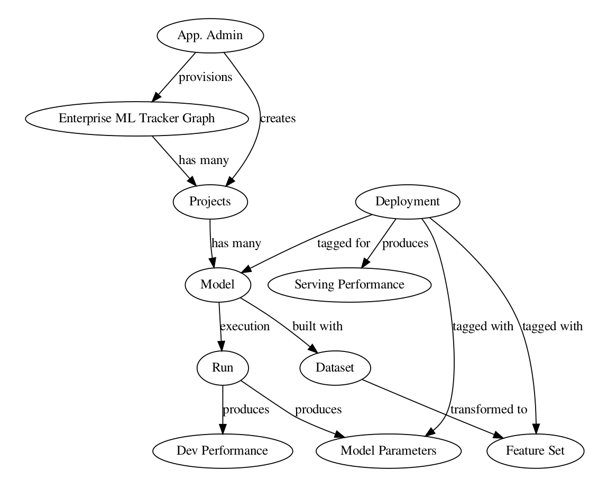

Arangopipe represents metadata as a graph. The nodes of the graph above are the principal elements about which metadata is gathered. These elements are high level abstractions that are encountered in any machine learning pipeline. A brief description of each of these elements is provided. Elements of the data model are either nodes or edges.

1. Dataset: This node captures metadata about datasets. Examples of attributes could be the storage location (URL), source system, creation date, summary statistics etc. .
2. Featureset: This node captures metadata about the features in the dataset. A featureset is obtained by applying a transformation to a dataset.
3. (Edge) Featureset - Dataset: Captures the dataset the associated featureset was generated from. Details of the transformation, for example the jupyter notebook that performs the transformation could be captured as part of the edge data.
4. Run: Captures metadata about the execution of a pipeline, for example the start time and the end time, status of execution (errors encountered) etc. .
5. Project: Captures metadata about the project associated with a pipeline. This is created with **ArangopipeAdmin**
6. Model: Captures metadata about the model. JSON serialized representations of model metadata can be stored if desiered. For example, if the model is used for hyper-parameter optimization. The hyper-parameter space can be stored in JSON serialized format.
7. DevPerf: Captures metadata about the performance metrics gathered during execution of the pipeline. The metric captured depends on the purpose of the model. It could be the root mean square error (RMSE) for a regression model or the best performing model and associated hyper-parameters for a hyper-parameter optimization model.
8. Deployment: Captures metadata about a particular production deployment. This could include details like the scheduled date, current status (scheduled, active, archived )etc.
9. ServingPerf: Captures the serving performance for a particular period. This is associated with a deployment and could include a collection of metrics, for example model performance metrics, average response time etc. .
10. (Edge) Deployment - Model: Captures the model associated with a deployment
11. (Edge) Deployment - SevPerf: Captures the serving performance associated with a deployment.
12. (Edge) Run - Model: Captures the model associated with a pipeline execution
13. (Edge) Run - DevPerf: Captures the model performance observed in development
14. (Edge) Run - Dataset: Captures the dataset associated with a pipeline execution
15. (Edge) Run - Featureset: Captures the featureset associated with a pipeline execution.
16. Model Params: This captures the hyper-parameters and the parameters associated with model development.
17. (Edge) Run - Model Params: This captures the model parameters obtained with a pipeline execution.
18. (Edge) Deployment - Featureset: This captures the featureset associated with a deployment.
19. (Edge) Deployment - ModelParams: This captures the model parameters used with a deployment.
20. (Edge) Project - Models: This captures the models associated with a project.

The data associated with the nodes and edges of the graph are stored as documents. The documents do not have a fixed structure and represent data using key-value pairs. This offers flexibility and permits users to decide the metadata elements that they would like to store. This also permits users to store metadata from any machine learning tech stack in Arangopipe.

